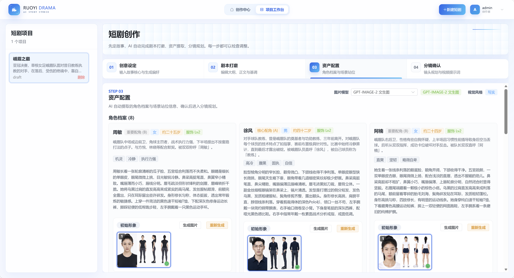
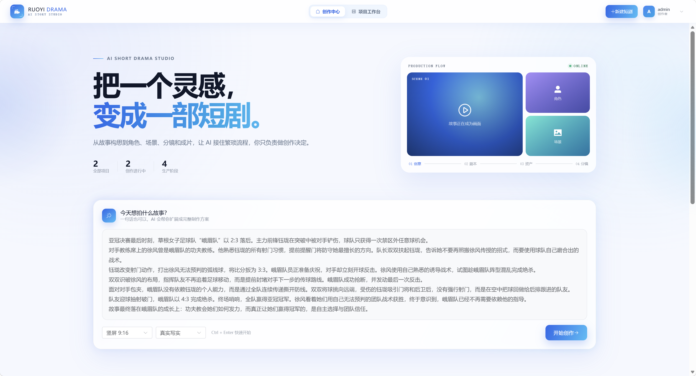
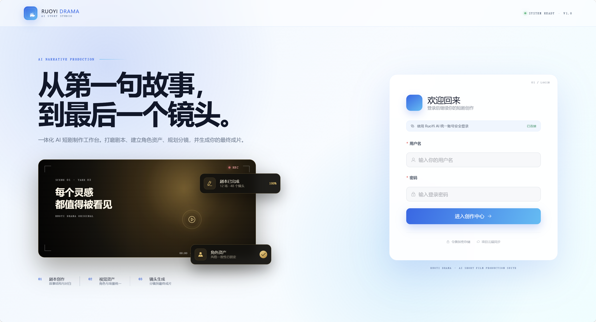
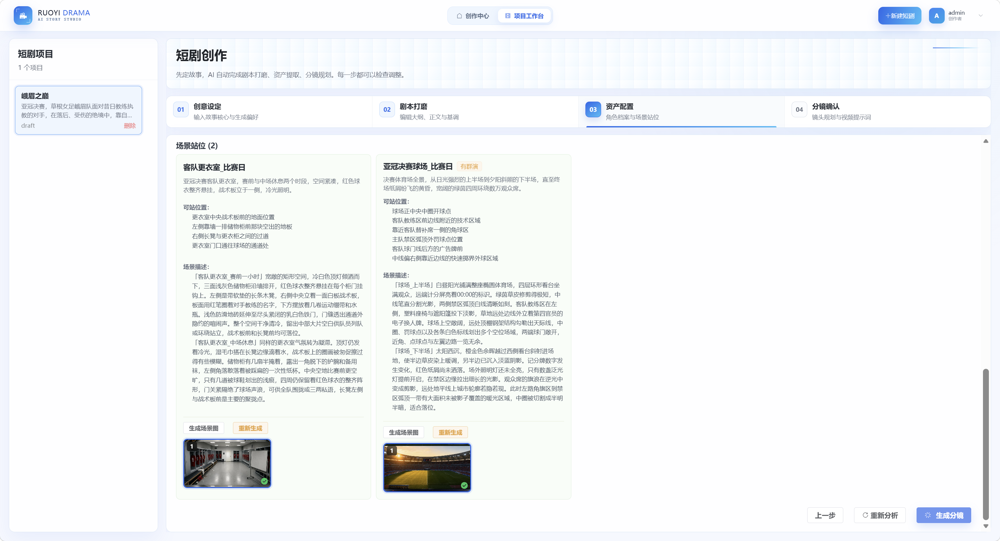
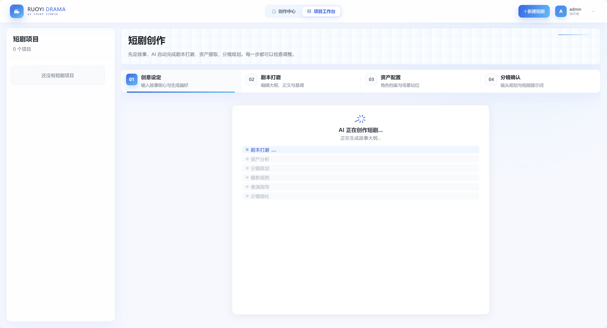

# ruoyi-drama

> **Backend Service** (The short drama frontend relies on this backend to run):
>
> | Platform | URL                                               |
> | -------- | ------------------------------------------------- |
> | GitHub   | https://github.com/ageerle/ruoyi-ai               |
> | Gitee    | https://gitee.com/ageerle/ruoyi-ai                |
>
> Please start the backend first according to the [ruoyi-ai](https://github.com/ageerle/ruoyi-ai) documentation. The default address is `http://127.0.0.1:6039`. This frontend will connect to it via a Vite proxy.

## Demo Screenshots

From inspiration input to final video output, fully demonstrating the creation workflow of a short drama: Creation Center Home → One-click Atlas Key Configuration → Script Refining → Asset Configuration → Storyboard Confirmation & Video Synthesis.











## Quick Tutorial

### 1. Start the Backend
Start the backend service according to the [ruoyi-ai](https://github.com/ageerle/ruoyi-ai) documentation, and ensure it is accessible at `http://127.0.0.1:6039`.

### 2. Start the Frontend
```bash
npm install
npm run dev
```
The default development URL is output by Vite, and the default backend is `http://127.0.0.1:6039`.

To switch the backend, simply modify `.env.development`:

```dotenv
VITE_API_URL=/dev-api
VITE_API_PROXY_TARGET=http://your-backend-address:port
VITE_CLIENT_ID=client-id-configured-in-backend
```

When `VITE_API_URL` uses a relative path, requests are proxied by Vite, which avoids browser cross-origin issues. You can also change it to the full backend URL, but the backend must allow cross-origin requests (CORS).

### 3. Login & Create
Open the frontend → Log in with a backend account (default admin account: `admin` / `admin123`) → Write your story inspiration on the "Creation Center" home page → Click "Start Creating" to enter the Short Drama Workspace, and sequentially complete script refining, asset configuration, storyboard confirmation, and video synthesis.

### 4. One-click Atlas Key Configuration (Important)
Image and video generation for short dramas rely on [Atlas Cloud](https://www.atlascloud.ai/). You need to configure your API Key before use:

1. Click the **"Key Configuration"** button in the upper right corner of the "Creation Center" home page.
2. Paste your Atlas Cloud API Key in the popup (available at [atlascloud.ai](https://www.atlascloud.ai/)).
3. Click **"Save & Apply"**, and the system will automatically apply this key in bulk to all Atlas models (the same key is shared across chat, image, and video).
4. A prompt saying "Atlas Key has been updated in bulk" indicates successful configuration. Return to the Short Drama Workspace to generate images and videos.

> This interface corresponds to the backend `PUT /system/model/batchKeyByProvider`, which batch updates `chat_model.api_key` based on the provider code `atlas`. It requires the `system:model:edit` permission.

### 5. Install FFmpeg (Required for Video Synthesis)
The "Storyboard to Video Synthesis" feature for short dramas relies on FFmpeg on the backend (must include `libx264` and `aac` encoders). On Windows, you can use the one-click script provided in the `ruoyi-ai` repository to automatically install and configure environment variables:

```powershell
# Execute in the root directory of the ruoyi-ai repository (Windows PowerShell)
powershell -ExecutionPolicy Bypass -File .\docs\script\install-ffmpeg-windows.ps1
```

The script will:
1. Check if `ffmpeg` / `ffprobe` are installed; if missing, it installs `Gyan.FFmpeg` via `winget`;
2. Write the absolute paths to the user environment variables `FFMPEG_PATH` and `FFPROBE_PATH`, and append them to `Path`;
3. Verify whether it includes the `libx264` and `aac` encoders; an error will be thrown directly if requirements are not met.

> After installation, you **must completely restart IntelliJ IDEA and the ruoyi-ai backend service** for Spring to read the new `FFMPEG_PATH` / `FFPROBE_PATH`.
> The script depends on `winget`. If not installed, it will prompt you to install the "App Installer" from the Microsoft Store first. Alternatively, you can run the backend using the project's Dockerfile (the image already includes FFmpeg).

## Production Build

```bash
npm run build
```

The build output is located in `dist/`. The default production API prefix is `/prod-api`, and the example `nginx.conf` proxies this prefix to `http://127.0.0.1:6039`. Simply modify `proxy_pass` according to your actual deployment environment.

---

## Exclusive Sponsor

Visit [Atlas Cloud Official Website](https://www.atlascloud.ai?ref=89F97E&utm_source=github&utm_campaign=ruoyi-drama) · Developer Program Discount

A full-modal AI inference platform providing developers with a unified AI API, supporting video generation, image generation, and large language models. Connect once to access 300+ curated models.
