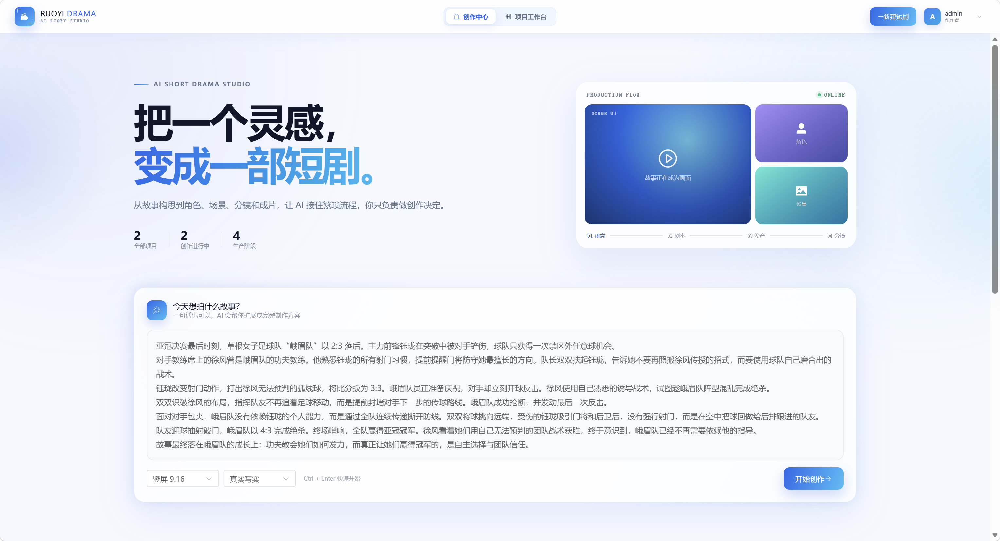
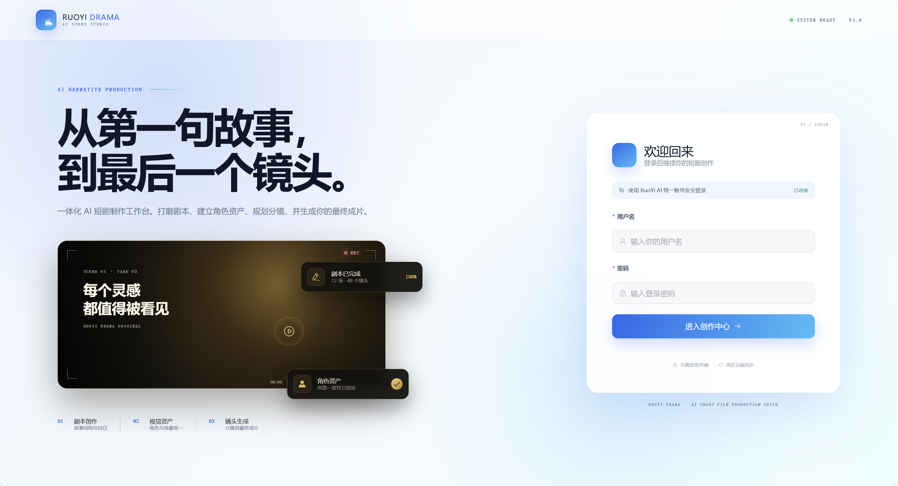
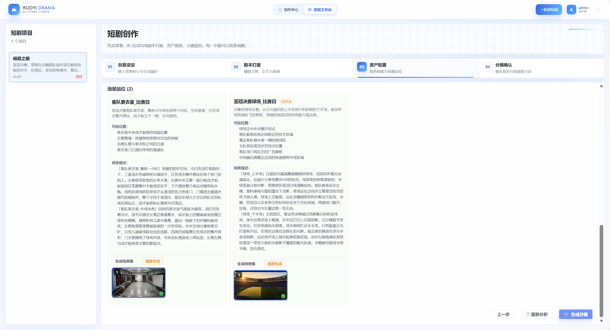
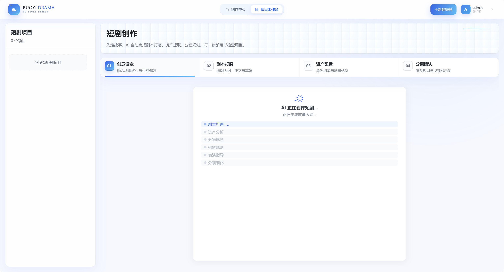

# ruoyi-drama

> **后端服务**（短剧前端依赖此前端运行的后台）：
>
> | 平台    | 地址                                              |
> | ------- | ------------------------------------------------- |
> | GitHub  | https://github.com/ageerle/ruoyi-ai               |
> | Gitee   | https://gitee.com/ageerle/ruoyi-ai                |
>
> 请先按 [ruoyi-ai](https://github.com/ageerle/ruoyi-ai) 文档启动后台，默认地址 `http://127.0.0.1:6039`，本前端会通过 Vite 代理与之对接。

## 演示截图

从灵感输入到成片输出，完整呈现一条短剧的创作流程：创作中心首页 → 一键配置 Atlas Key → 剧本打磨 → 资产配置 → 分镜确认与视频合成。










## 简单教程

### 1. 启动后台
按 [ruoyi-ai](https://github.com/ageerle/ruoyi-ai) 文档启动后台服务，确保能访问 `http://127.0.0.1:6039`。

### 2. 启动前端
```bash
npm install
npm run dev
```
默认开发地址由 Vite 输出，默认后台为 `http://127.0.0.1:6039`。

如需切换后台，只修改 `.env.development`：

```dotenv
VITE_API_URL=/dev-api
VITE_API_PROXY_TARGET=http://你的后台地址:端口
VITE_CLIENT_ID=后台配置的客户端ID
```

`VITE_API_URL` 使用相对路径时，请求由 Vite 代理，可以避免浏览器跨域问题；也可将它改为后台完整 URL，但后台需要允许跨域。

### 3. 登录创作
打开前端 → 使用后台账号登录（默认管理员账号 `admin` / `admin123`）→ 在「创作中心」首页写下故事灵感 → 点击「开始创作」进入短剧工作台，依次完成剧本打磨、资产配置、分镜确认与视频合成。

### 4. 一键配置 Atlas Key（重要）
短剧的图片 / 视频生成都依赖 [Atlas Cloud](https://www.atlascloud.ai/)。使用前需要配置 API Key：

1. 在「创作中心」首页右上角点击 **「Key 配置」** 按钮。
2. 在弹窗中粘贴你的 Atlas Cloud API Key（可在 [atlascloud.ai](https://www.atlascloud.ai/) 获取）。
3. 点击 **「保存并应用」**，系统会自动把该 Key 批量应用到所有 Atlas 模型（对话 / 图片 / 视频共用同一个 Key）。
4. 提示「Atlas Key 已批量更新」即配置成功，回到短剧工作台即可生成图片与视频。

> 该接口对应后台 `PUT /system/model/batchKeyByProvider`，按厂商编码 `atlas` 批量更新 `chat_model.api_key`，需拥有 `system:model:edit` 权限。

### 5. 安装 FFmpeg（视频合成必需）
短剧「分镜视频合成成片」功能依赖后端的 FFmpeg（需要包含 `libx264` 和 `aac` 编码器）。Windows 下可用 `ruoyi-ai` 仓库提供的一键脚本自动安装并配置环境变量：

```powershell
# 在 ruoyi-ai 仓库根目录执行（Windows PowerShell）
powershell -ExecutionPolicy Bypass -File .\docs\script\install-ffmpeg-windows.ps1
```

脚本会：
1. 检测是否已安装 `ffmpeg` / `ffprobe`，缺失则通过 `winget` 安装 `Gyan.FFmpeg`；
2. 把绝对路径写入用户环境变量 `FFMPEG_PATH`、`FFPROBE_PATH`，并追加到 `Path`；
3. 校验是否包含 `libx264`、`aac` 编码器，不满足会直接报错。

> 安装完成后**必须完全重启 IntelliJ IDEA 和 ruoyi-ai 后端服务**，Spring 才会读取到新的 `FFMPEG_PATH` / `FFPROBE_PATH`。
> 脚本依赖 `winget`，若未安装会提示先从 Microsoft Store 安装「应用安装程序」；也可改用项目 Dockerfile 运行后端（镜像内已含 FFmpeg）。

## 生产构建

```bash
npm run build
```

产物位于 `dist/`。默认生产接口前缀为 `/prod-api`，示例 `nginx.conf` 会将该前缀代理到 `http://127.0.0.1:6039`。部署时按实际情况修改 `proxy_pass` 即可。

---

## 独家赞助

访问 [Atlas Cloud 官网](https://www.atlascloud.ai?ref=89F97E&utm_source=github&utm_campaign=ruoyi-drama) · 编程计划优惠

全模态 AI 推理平台，为开发者提供统一的 AI API，支持视频生成、图像生成和大语言模型。一次接入，即可访问 300+ 精选模型。
